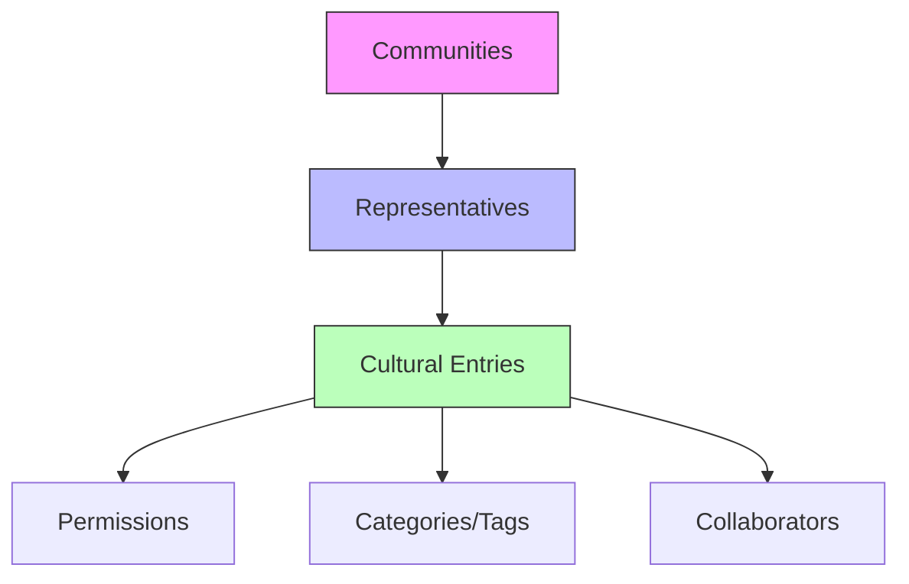

# CultureGrid - Cultural Heritage Registry

A decentralized platform for preserving and sharing humanity's diverse cultural heritage on the blockchain.

## Overview

CultureGrid enables communities worldwide to permanently preserve their cultural heritage through a decentralized registry. The platform allows authorized cultural representatives to document and protect:

- Traditional stories and oral histories
- Cultural ceremonies and practices
- Digital representations of cultural artifacts
- Traditional knowledge and customs
- Geographic and historical context

Each cultural entry is represented as a unique digital asset with rich metadata, creating an immutable record while respecting cultural ownership and usage rights.

## Architecture

The system is built around a community-based governance model where cultural groups maintain autonomy over their contributions while making them accessible to a global audience.



### Core Components

1. **Communities** - Registered cultural groups with verified administrators
2. **Representatives** - Authorized members who can create and manage cultural entries
3. **Cultural Entries** - Digital assets containing cultural heritage information
4. **Permissions** - Access and usage rights for cultural content
5. **Categories** - Classification system for discovery and organization

## Contract Documentation

### Key Features

- Community registration and management
- Representative authorization system
- Cultural heritage entry creation and management
- Flexible permission controls
- Collaborative editing capabilities
- Categorization and tagging system

### Access Control

- Community administrators can manage representatives
- Verified representatives can create cultural entries
- Entry owners can manage permissions and collaborators
- Collaborators have limited update rights based on assigned permissions

## Getting Started

### Prerequisites

- Clarinet
- Stacks wallet for deployment

### Installation

1. Clone the repository
2. Install dependencies with Clarinet
3. Deploy contracts to the desired network

### Basic Usage

```clarity
;; Register a new community
(contract-call? .culture-grid register-community 
    "community-id" 
    "Community Name" 
    "Description" 
    "Geographic Region"
)

;; Create a cultural entry
(contract-call? .culture-grid register-cultural-entry 
    "entry-id"
    "Title"
    "Description"
    "community-id"
    "Geographic Origin"
    none
    "Cultural Significance"
    (list)
    true
    (list)
    (list)
    true
    "Category"
    (list)
    (list)
)
```

## Function Reference

### Community Management

```clarity
(register-community (community-id (string-ascii 50)) (name (string-utf8 100)) (description (string-utf8 500)) (region (string-ascii 100)))
(add-community-representative (community-id (string-ascii 50)) (representative principal) (verified bool))
(remove-community-representative (community-id (string-ascii 50)) (representative principal))
```

### Cultural Entries

```clarity
(register-cultural-entry (entry-id (string-ascii 50)) ...)
(update-cultural-entry (entry-id (string-ascii 50)) ...)
(update-entry-permissions (entry-id (string-ascii 50)) ...)
(transfer-entry-ownership (entry-id (string-ascii 50)) (new-owner principal))
```

### Collaboration

```clarity
(add-entry-collaborator (entry-id (string-ascii 50)) (collaborator principal) (role (string-ascii 30)) (permissions (list 5 (string-ascii 30))))
(remove-entry-collaborator (entry-id (string-ascii 50)) (collaborator principal))
```

## Development

### Testing

Run tests using Clarinet:

```bash
clarinet test
```

### Local Development

1. Start Clarinet console:
```bash
clarinet console
```

2. Test functions interactively

## Security Considerations

### Access Control
- Only verified representatives can create entries
- Entry modifications require appropriate permissions
- Ownership transfers are restricted to current owners

### Cultural Sensitivity
- Communities maintain control over their cultural content
- Flexible permission system for cultural protocols
- Attribution requirements can be enforced

### Limitations
- Storage constraints for media content (links only)
- Community verification process needs external oversight
- Limited to Stacks blockchain ecosystem